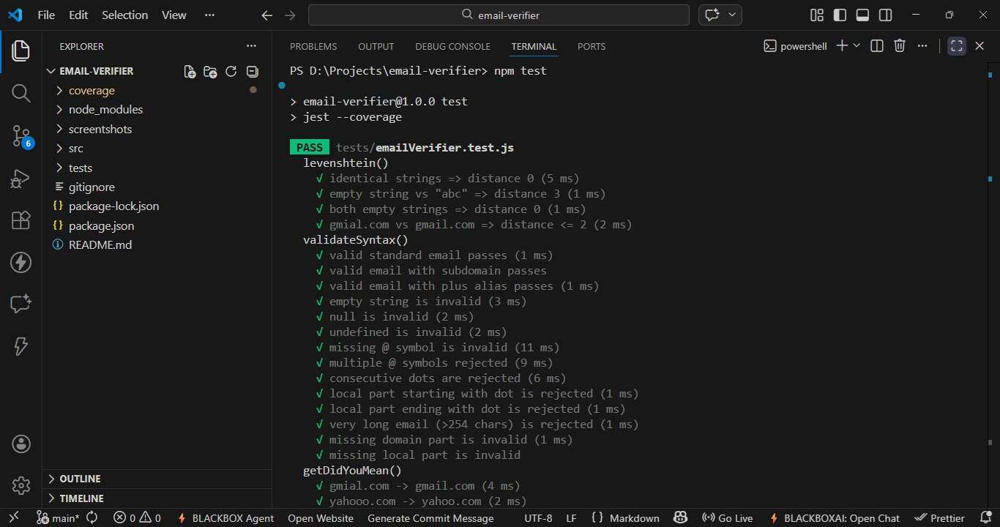
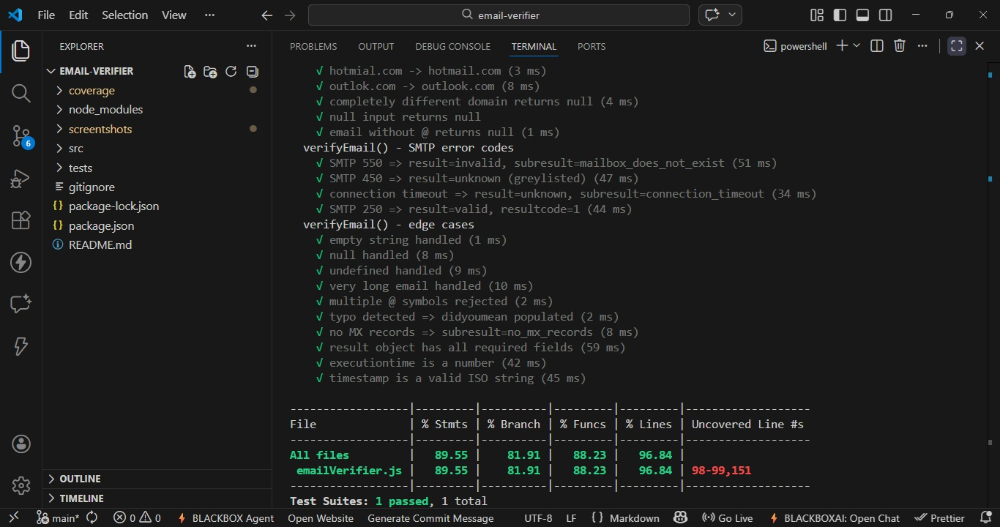
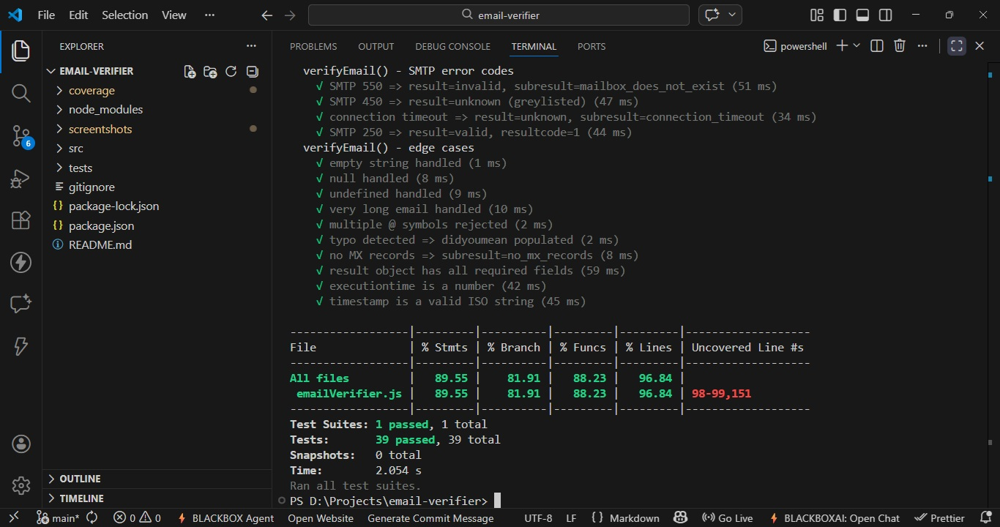

# Email Verification Module

A Node.js module that verifies email addresses using DNS MX lookup and SMTP probing, with built-in typo detection.

---

## Project Structure

```
email-verifier/
├── src/
│   └── emailVerifier.js
├── tests/
│   └── emailVerifier.test.js
├── package.json
└── README.md
```

---

## Setup

```bash
npm install
```

---

## Running Tests

```bash
npm test
```

---

## Usage

```js
const { verifyEmail, getDidYouMean } = require('./src/emailVerifier');

async function main() {
  const result = await verifyEmail('user@gmial.com');
  console.log(result);
}

main();
```

Run it:

```bash
node run.js
```

---

## Functions

### `verifyEmail(email)`

Fully verifies an email address — syntax check, DNS MX lookup, and SMTP probe.

**Returns:**
```json
{
  "email": "user@example.com",
  "result": "valid",
  "resultcode": 1,
  "subresult": "mailbox_exists",
  "domain": "example.com",
  "mxRecords": ["mx1.example.com"],
  "didyoumean": null,
  "executiontime": 1.23,
  "error": null,
  "timestamp": "2026-03-03T10:00:00.000Z"
}
```

### `getDidYouMean(email)`

Suggests a correction if the domain looks like a typo (Levenshtein distance ≤ 2).

```js
getDidYouMean('user@gmial.com')   // → 'user@gmail.com'
getDidYouMean('user@yahooo.com')  // → 'user@yahoo.com'
getDidYouMean('user@gmail.com')   // → null
```

---

## Result Codes

| Code | Meaning  |
|------|----------|
| 1    | valid    |
| 3    | unknown  |
| 6    | invalid  |

## Subresults

| Subresult                  | Meaning                                      |
|----------------------------|----------------------------------------------|
| `mailbox_exists`           | SMTP confirmed mailbox exists                |
| `mailbox_does_not_exist`   | SMTP 550/551/553 — mailbox not found         |
| `greylisted`               | SMTP 450/451/452 — temporary rejection       |
| `typo_detected`            | Domain looks like a typo (did you mean?)     |
| `no_mx_records`            | DNS lookup failed — no MX records            |
| `invalid_syntax`           | Email failed format validation               |
| `connection_timeout`       | SMTP server did not respond in time          |
| `connection_error`         | Could not reach the SMTP server              |
| `smtp_unavailable`         | SMTP 421 — server busy/unavailable           |

---

## Note on Real SMTP Probing

Most mail servers (Gmail, Yahoo, etc.) block port 25 and reject `RCPT TO` probing. So on real emails, the result will often be `unknown / connection_error`. The logic is correct and all SMTP paths are fully tested using mocked sockets in the test suite.

## Screenshots





